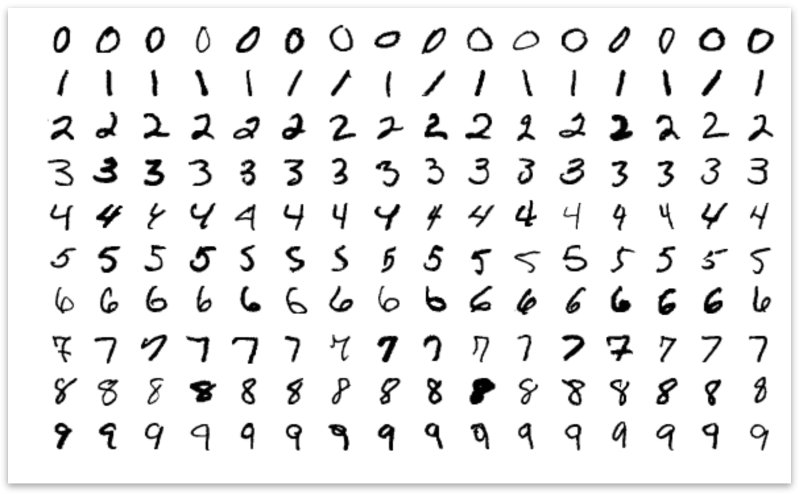
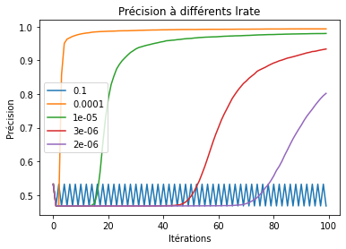
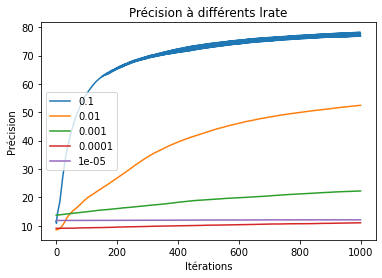
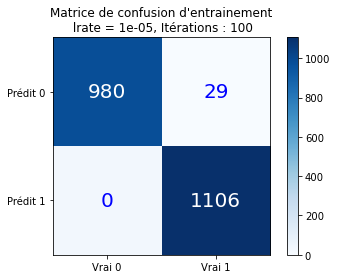
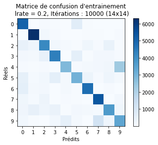
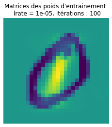
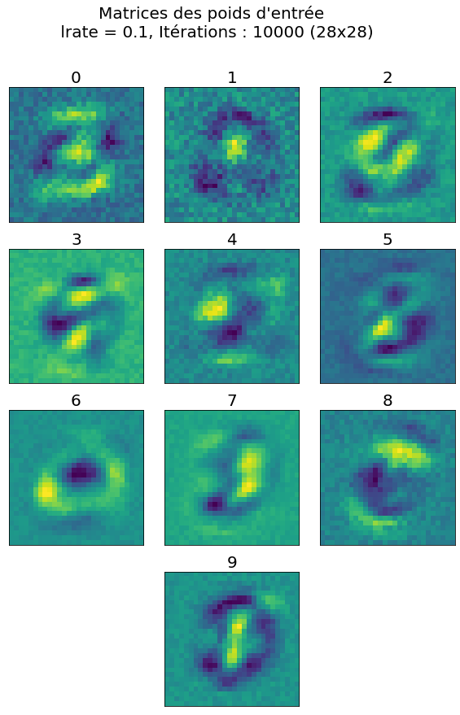

# Perceptron from Scratch

**A from-scratch study of binary and multiclass handwritten-digit classification.**

This repository revisits my December 2022 L3 Physics project at Université Paris Cité. The goal was not to call a machine-learning classifier, but to implement the learning rules with NumPy, inspect their behavior on MNIST, and understand where a linear perceptron stops being enough.

> Educational implementation: `scikit-learn` is used only to download MNIST. Both classifiers, momentum, gradients, attribution, and evaluation logic are implemented in this repository.

## What was investigated

The project follows two steps:

1. **Binary classification (0 vs 1).** A Rosenblatt perceptron learns one linear decision boundary and updates its weights only after a mistake.
2. **Multiclass classification (0–9).** A configurable NumPy MLP uses one or two ReLU hidden layers, stable softmax, cross-entropy, SGD, or momentum implemented from scratch.

The original study also tested learning-rate sensitivity, visualized learned pixel weights, followed confusion matrices during training, and reduced MNIST images from 28×28 to 14×14 with nearest-neighbor sampling.

## Results from the 2022 study

The binary model classified more than 99% of the selected 0/1 samples correctly. Its train and test curves remained close, suggesting good generalization for this linearly separable task.

| Binary perceptron | Multiclass network |
|---|---|
|  |  |

The one-hidden-layer multiclass model plateaued around **70% accuracy**. This is not presented as a competitive MNIST result: it documents the limits of the deliberately small architecture and original full-batch training method.

The reconstructed optimized profile reaches **97.34% test accuracy** with full-resolution grayscale inputs, hidden layers `(64, 32)`, mini-batch momentum, and mild learning-rate decay. Notebook runs both profiles so the historical result remains visible rather than being replaced.

| Binary perceptron | Multiclass network |
|---|---|
|  |  |

Visualisation of the weights matrices can also be found and were discussed.
| Binary perceptron | Multiclass network |
|---|---|
|  |  |

The report contains the complete methodology and discussion:

- [Project report (French PDF)](docs/project-report.pdf)
- [Presentation (French PDF)](docs/presentation.pdf)

## Reproduce the study

Python 3.10 or newer is required.

Open [`perceptron_mnist.ipynb`](perceptron_mnist.ipynb). It downloads full MNIST into ignored `data/`, preserves the final 10,000 samples for testing, and creates a deterministic validation split from the first 60,000 samples.

## Training experiments

Notebook executes two explicit, reproducible profiles:

| Profile | Resolution | Hidden layers | Optimizer | Batch | Learning rate | Decay | Test accuracy |
|---|---:|---:|---|---:|---:|---:|---:|
| Historical baseline | 14×14 | `(10,)` | SGD | Full | `0.04` | None | ≥70% |
| Optimized | 28×28 | `(64, 32)` | Momentum `0.9` | 256 | `0.01` | `0.0005` | **97.34%** |

MNIST remains grayscale: preprocessing divides pixel values by 255 but does not threshold them. The cached dataset contains all 256 intensity values. Preserving stroke intensity produced the strongest tested result.

`MultilayerPerceptron(hidden_layers=(10,))` is the main model. It accepts one or two hidden layers.

Training returns train/validation loss, accuracy, and effective learning-rate histories. The notebook plots these together to distinguish underfitting from overfitting. It also renders decision evidence:

- binary accuracy, validation accuracy, and mistakes per epoch;
- exact Rosenblatt pixel contributions for mean digits 0 and 1;
- one class-conditioned decision-evidence map per digit;
- representative test images paired with signed `input-gradient × input` attribution;
- deeper hidden-layer and output-layer connection heatmaps, labeled as architecture rather than image explanations;
- final test confusion matrices.

Raw hidden kernels remain accessible, but they are not presented as digit templates: nonlinear activation and downstream weights determine their effect. Red evidence supports the selected class; blue evidence opposes it. Plots display inside the notebook and are not automatically written to image files.

## What changed in this reconstruction

The original scripts mixed data loading, model code, plotting, and execution in global state. This reconstruction separates those concerns, uses sample-major array shapes consistently, stabilizes softmax numerically, makes randomness explicit, and measures validation behavior. Optional mini-batches, momentum, decay, early stopping, and one extra hidden layer support controlled experiments without hiding changes behind a tuned default.

The debugging journey mattered as much as the final curves: I found shape errors that NumPy accepted silently, a softmax normalization over the wrong axis, exploding exponentials, and dataset-format mismatches.

## Authorship

Project, report, presentation, implementations, and reconstruction by **Eloi Raad**.
